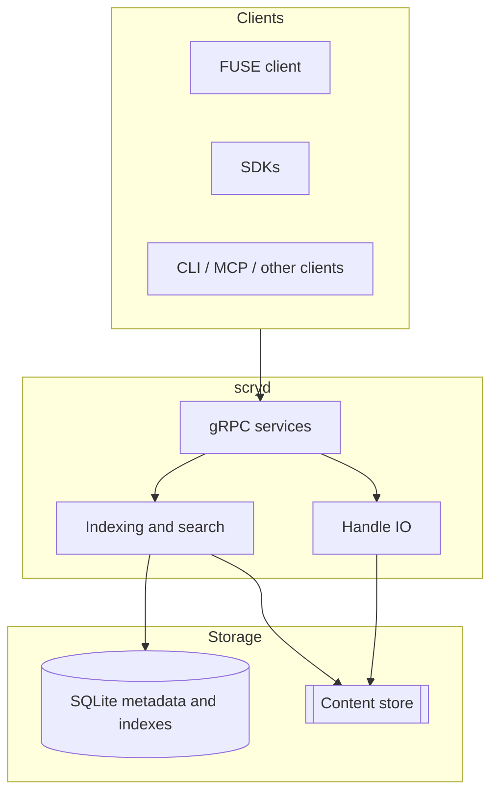

# Scry

**Agent-native workspace infrastructure**: a regular folder for users, a composable file, index, and search substrate for systems.

[](https://github.com/funstory-ai/scry/actions/workflows/ci.yml)
[](./LICENSE)
[](./rust-toolchain.toml)

- [中文](#中文)
- [English](#english)

---

## 中文

Scry 是面向 Agent 应用的 workspace 基础设施。它把文件存储、元数据、全文检索、向量检索、事件订阅和访问控制收敛到一套 gRPC / Protobuf 契约中；FUSE、CLI 和 SDK 都是这套契约之上的薄客户端。

### 核心能力

| 能力 | 说明 |
|------|------|
| gRPC 服务端 | `scryd` 提供 Health、Admin、Namespace、Mutation、Files、Io、Search、Events 等服务 |
| 文件与内容存储 | 通过 `ContentStore` 抽象本地文件系统、JuiceFS 等内容后端 |
| 元数据与索引 | SQLite WAL、FTS5、sqlite-vec；每个 workspace 一个 `{index_root}/{workspace_id}/index.db`，workspace catalog 走独立的 SQLite 或 Postgres |
| Handle IO | `Io.Open/Read/Write/Truncate/Flush/Release`，支持大文件流式写入与 tempfile 溢出 |
| 搜索 | 支持全文、向量和 Hybrid RRF 检索 |
| 事件订阅 | 支持数据库回放、broadcast 分发和 subscriber ack 位点 |
| 鉴权与传输 | TCP、Unix socket、可选 TLS/mTLS；HMAC-SHA256 workspace/admin/local token |
| 客户端 | FUSE 客户端与 TypeScript SDK 预览版 |

### 架构概览



Scry 将 metadata 与 content 物理分离：SQLite 索引库适合放在本地 SSD/NVMe，内容目录可以放在本地磁盘或共享文件系统中。

### 仓库结构

| 路径 | 说明 |
|------|------|
| [`proto/scry/v1/workspace.proto`](proto/scry/v1/workspace.proto) | gRPC API 契约 |
| [`crates/scry-proto`](crates/scry-proto) | Protobuf 与 tonic 生成代码 |
| [`crates/scry-storage`](crates/scry-storage) | 内容存储 trait 与实现 |
| [`crates/scry-index`](crates/scry-index) | SQLite schema、索引与检索工具 |
| [`crates/scryd`](crates/scryd) | 主服务二进制 |
| [`crates/scry-fuse`](crates/scry-fuse) | FUSE 客户端 |
| [`clients/typescript`](clients/typescript) | `@scry/sdk` 预览客户端 |
| [`config`](config) | 示例配置 |
| [`ops`](ops) | 备份、恢复与演练脚本 |
| [`docs`](docs) | 架构、运维和发布验证文档 |

### 前置要求

- Rust stable（见 [`rust-toolchain.toml`](rust-toolchain.toml)）
- Linux 开发环境
- FUSE3 头文件与库（仅在编译或运行真实 FUSE 挂载时需要）
- Node.js 与 npm（仅在开发 TypeScript SDK 时需要）

### 快速开始

启动 `scryd`：

```bash
cargo run -p scryd
```

默认监听 `127.0.0.1:50051`。健康检查：

```bash
cargo run -p scryd -- ping
```

推荐使用 YAML 配置：

```bash
cargo run -p scryd -- --config ./config/scryd.example.yaml
```

也可以通过环境变量覆盖单个字段：

```bash
SCRYD_AUTH_SECRET="$(openssl rand -hex 32)" \
SCRYD_GRPC_ADDR=127.0.0.1:50051 \
cargo run -p scryd -- --config ./config/scryd.example.yaml
```

最小配置示例：

```yaml
server:
  content_root: /tmp/scry/content
  index_root: /tmp/scry/index    # 每个 workspace 一个 {index_root}/{workspace_id}/index.db

transport:
  grpc_addr: 127.0.0.1:50051

auth:
  secret: "replace-with-long-random-secret"
  allow_local_no_auth: false

catalog:
  backend: sqlite                # 独立 catalog 文件，默认 {index_root}/_catalog.db
  # db_path: /tmp/scry/catalog.db
  # 或：backend: postgres + postgres_url: postgres://.../scryd
```

### 常用 CLI

```bash
# 签发 admin token
cargo run -p scryd -- token mint --kind admin --scope '*' --ttl-secs 3600

# 创建 workspace
cargo run -p scryd -- admin create-workspace --name demo

# 查看 workspace 列表
cargo run -p scryd -- admin list-workspaces --limit 10

# 检查 catalog 一致性
cargo run -p scryd -- catalog reconcile
```

### FUSE 客户端

默认检查不依赖宿主机 FUSE：

```bash
cargo check -p scry-fuse
```

编译和运行真实挂载需要启用 `fuse` feature：

```bash
cargo check -p scry-fuse --features fuse

cargo run -p scry-fuse --features fuse -- \
  --workspace-id <workspace-id> \
  --mountpoint <mountpoint> \
  --server-addr 127.0.0.1:50051 \
  --auth-token <workspace-token>
```

### TypeScript SDK

```bash
cd clients/typescript
npm ci
npm run build
npm test
```

```ts
import { createScryClient, SearchMode } from "@scry/sdk";

const scry = createScryClient({
  endpoint: "http://127.0.0.1:50051",
  token: process.env.SCRY_TOKEN!,
});

const { workspaceId } = await scry.createWorkspace("demo");
const ws = scry.workspace(workspaceId);
await ws.filesApi.put("docs/hello.md", Buffer.from("hello\n"));
const hits = await ws.search("hello", { mode: SearchMode.SEARCH_MODE_HYBRID });

console.log(hits);
scry.close();
```

### 备份与恢复

每个 workspace 的 `index.db` 与独立 catalog 文件分别备份：

```bash
WS_ID="<workspace_id>"

# 备份单个 workspace 的索引
ops/backup/vacuum_backup.sh \
  /tmp/scry/index/${WS_ID}/index.db \
  /tmp/scry/backups/${WS_ID}-$(date +%s).db

# 备份独立 catalog（默认路径 {index_root}/_catalog.db）
ops/backup/vacuum_backup.sh \
  /tmp/scry/index/_catalog.db \
  /tmp/scry/backups/_catalog-$(date +%s).db

# 从备份恢复（覆盖目标 index.db）
ops/recovery/restore_from_backup.sh \
  /tmp/scry/backups/${WS_ID}-123456.db \
  /tmp/scry/index/${WS_ID}/index.db --force
```

完整步骤见 [`docs/runbooks/backup-restore.md`](docs/runbooks/backup-restore.md)。

### 开发与测试

```bash
cargo check --workspace
cargo test --workspace
cargo clippy --workspace --all-targets -- -D warnings
cargo fmt --all -- --check
```

### 参与贡献

欢迎提交 issue 和 pull request。贡献时请遵循以下原则：

1. 保持 `proto/scry/v1/workspace.proto` 作为 API 契约的单一真相来源。
2. 让 FUSE、CLI 和 SDK 复用同一套服务语义。
3. 对协议、存储格式、鉴权或运行时配置的变更同步更新文档。
4. PR 描述应说明动机、行为变化、验证方式和回滚方式。

### 安全

请不要在公开 issue 中披露可利用的安全细节。如发现漏洞，请通过维护者认可的私密渠道报告。

### 许可证

Scry 使用 MIT 许可证，详见 [`LICENSE`](LICENSE)。

---

## English

Scry is workspace infrastructure for agent applications. It brings file storage, metadata, full-text search, vector search, event streams, and access control behind one gRPC / Protobuf contract. FUSE, CLI tools, and SDKs remain thin clients over the same API.

### Highlights

| Capability | Description |
|------------|-------------|
| gRPC server | `scryd` serves Health, Admin, Namespace, Mutation, Files, Io, Search, and Events APIs |
| File and content storage | `ContentStore` abstracts local filesystems, JuiceFS mounts, and similar backends |
| Metadata and indexes | SQLite WAL, FTS5, sqlite-vec; each workspace owns its own `{index_root}/{workspace_id}/index.db`, with the workspace catalog in a standalone SQLite file or Postgres |
| Handle IO | `Io.Open/Read/Write/Truncate/Flush/Release` with streaming writes and tempfile spillover |
| Search | Full-text, vector, and hybrid RRF search modes |
| Event streams | Database replay, broadcast delivery, and per-subscriber acknowledgements |
| Auth and transport | TCP, Unix sockets, optional TLS/mTLS, and HMAC-SHA256 workspace/admin/local tokens |
| Clients | FUSE client and preview TypeScript SDK |

### Architecture


Scry separates metadata from content: keep the SQLite index database on local SSD/NVMe, and place content on local disks or shared filesystems as needed.

### Repository layout

| Path | Purpose |
|------|---------|
| [`proto/scry/v1/workspace.proto`](proto/scry/v1/workspace.proto) | gRPC API contract |
| [`crates/scry-proto`](crates/scry-proto) | Protobuf and tonic generated code |
| [`crates/scry-storage`](crates/scry-storage) | Content storage trait and implementations |
| [`crates/scry-index`](crates/scry-index) | SQLite schema, indexing, and search utilities |
| [`crates/scryd`](crates/scryd) | Main server binary |
| [`crates/scry-fuse`](crates/scry-fuse) | FUSE client |
| [`clients/typescript`](clients/typescript) | Preview `@scry/sdk` client |
| [`config`](config) | Example configuration |
| [`ops`](ops) | Backup, recovery, and drill scripts |
| [`docs`](docs) | Architecture, operations, and release validation docs |

### Requirements

- Rust stable (see [`rust-toolchain.toml`](rust-toolchain.toml))
- Linux development environment
- FUSE3 headers and libraries, only for real FUSE mount builds/runs
- Node.js and npm, only for TypeScript SDK development

### Quick start

Start `scryd`:

```bash
cargo run -p scryd
```

The default listener is `127.0.0.1:50051`. Run a health check:

```bash
cargo run -p scryd -- ping
```

YAML configuration is recommended:

```bash
cargo run -p scryd -- --config ./config/scryd.example.yaml
```

Override individual fields with environment variables:

```bash
SCRYD_AUTH_SECRET="$(openssl rand -hex 32)" \
SCRYD_GRPC_ADDR=127.0.0.1:50051 \
cargo run -p scryd -- --config ./config/scryd.example.yaml
```

Minimal configuration:

```yaml
server:
  content_root: /tmp/scry/content
  index_root: /tmp/scry/index    # one {index_root}/{workspace_id}/index.db per workspace

transport:
  grpc_addr: 127.0.0.1:50051

auth:
  secret: "replace-with-long-random-secret"
  allow_local_no_auth: false

catalog:
  backend: sqlite                # standalone catalog file, defaults to {index_root}/_catalog.db
  # db_path: /tmp/scry/catalog.db
  # Or: backend: postgres + postgres_url: postgres://.../scryd
```

### Common CLI commands

```bash
# Mint an admin token
cargo run -p scryd -- token mint --kind admin --scope '*' --ttl-secs 3600

# Create a workspace
cargo run -p scryd -- admin create-workspace --name demo

# List workspaces
cargo run -p scryd -- admin list-workspaces --limit 10

# Check catalog consistency
cargo run -p scryd -- catalog reconcile
```

### FUSE client

The default check does not require host FUSE libraries:

```bash
cargo check -p scry-fuse
```

Enable the `fuse` feature to build and run a real mount:

```bash
cargo check -p scry-fuse --features fuse

cargo run -p scry-fuse --features fuse -- \
  --workspace-id <workspace-id> \
  --mountpoint <mountpoint> \
  --server-addr 127.0.0.1:50051 \
  --auth-token <workspace-token>
```

### TypeScript SDK

```bash
cd clients/typescript
npm ci
npm run build
npm test
```

```ts
import { createScryClient, SearchMode } from "@scry/sdk";

const scry = createScryClient({
  endpoint: "http://127.0.0.1:50051",
  token: process.env.SCRY_TOKEN!,
});

const { workspaceId } = await scry.createWorkspace("demo");
const ws = scry.workspace(workspaceId);
await ws.filesApi.put("docs/hello.md", Buffer.from("hello\n"));
const hits = await ws.search("hello", { mode: SearchMode.SEARCH_MODE_HYBRID });

console.log(hits);
scry.close();
```

### Backup and recovery

Each workspace's `index.db` and the standalone catalog file are backed up independently:

```bash
WS_ID="<workspace_id>"

# Back up a single workspace's index
ops/backup/vacuum_backup.sh \
  /tmp/scry/index/${WS_ID}/index.db \
  /tmp/scry/backups/${WS_ID}-$(date +%s).db

# Back up the standalone catalog (default path {index_root}/_catalog.db)
ops/backup/vacuum_backup.sh \
  /tmp/scry/index/_catalog.db \
  /tmp/scry/backups/_catalog-$(date +%s).db

# Restore from a backup (overwrites the target index.db)
ops/recovery/restore_from_backup.sh \
  /tmp/scry/backups/${WS_ID}-123456.db \
  /tmp/scry/index/${WS_ID}/index.db --force
```

See [`docs/runbooks/backup-restore.md`](docs/runbooks/backup-restore.md) for the full procedure.

### Development and testing

```bash
cargo check --workspace
cargo test --workspace
cargo clippy --workspace --all-targets -- -D warnings
cargo fmt --all -- --check
```

### Contributing

Issues and pull requests are welcome. Please follow these guidelines:

1. Keep `proto/scry/v1/workspace.proto` as the single source of truth for the API contract.
2. Make FUSE, CLI, and SDK clients share the same service semantics.
3. Update documentation when changing the protocol, storage format, auth model, or runtime configuration.
4. Describe motivation, behavior changes, validation, and rollback strategy in pull requests.

### Security

Please do not disclose exploitable security details in public issues. Report vulnerabilities through a private channel approved by the maintainers.

### License

Scry is licensed under MIT. See [`LICENSE`](LICENSE).
